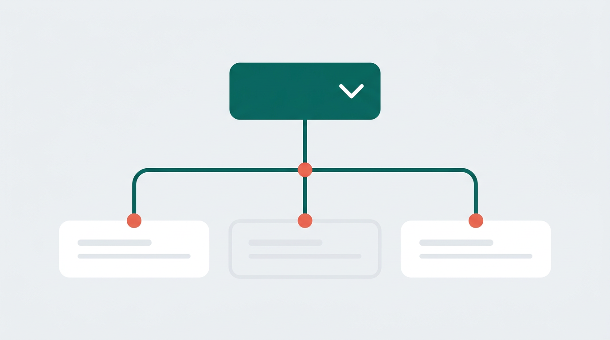
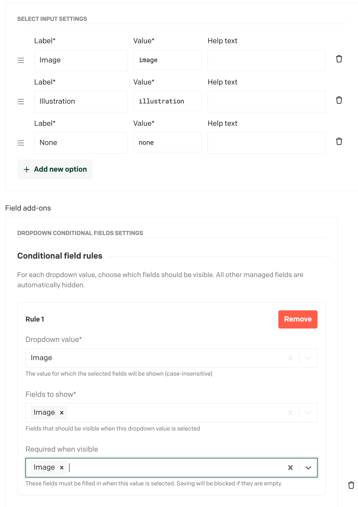

# Dropdown Conditional Fields — DatoCMS Plugin



Conditionally show or hide fields in your DatoCMS record forms based on the selected value of a dropdown field. Ships with a **visual rule editor** — no raw JSON required.

> **Fork notice:** This plugin is based on the original [datocms-plugin-dropdown-conditional-fields](https://github.com/dewyze/datocms-plugin-dropdown-conditional-fields) by [John DeWyze](https://github.com/dewyze). It has been rewritten from scratch for the modern DatoCMS Plugin SDK (v2), migrated from Webpack to Vite, converted to React + TypeScript, and extended with a visual configuration UI. Thank you, John, for the original idea and implementation!

---

## How It Works

1. A **dropdown (select) field** acts as the trigger.
2. You define **rules**: for each possible dropdown value, you choose which other fields in the same model should be **visible**.
3. All fields managed by the plugin but **not** matching the current dropdown value are **automatically hidden**.

## Setup Guide

### 1. Create the Trigger Field

In your DatoCMS model, create a **Single-line string** field (e.g. `category`).

Under **Presentation**, set the editor to **"Select input"** and add your dropdown options (e.g. `Blog`, `Product`, `Event`).

### 2. Install the Plugin

Install from the [DatoCMS Marketplace](https://www.datocms.com/marketplace/plugins) or add it as a private plugin under **Settings > Plugins**.

### 3. Attach the Plugin to Your Field

Open the trigger field settings and go to the **Presentation** tab. Under **Field Add-ons**, click **"Add"** and select **"Dropdown Conditional Fields"**.

### 4. Configure the Rules

After adding the addon, a **visual rule editor** will appear:



- Click **"+ Add new rule"** to add a rule.
- If the field has enum validators, pick the **dropdown value** from the list. Otherwise, type the exact value.
- Select the **fields to show** — all other fields in the model are available for selection.
- Add as many rules as you need.

**Example:** If your dropdown has values `Blog`, `Product`, and `Event`:

| Dropdown Value | Visible Fields          |
| -------------- | ----------------------- |
| `blog`         | `author`, `content`     |
| `product`      | `price`, `availability` |
| `event`        | `date`, `location`      |

Fields not assigned to the currently selected value will be hidden automatically.

### 5. Global Settings (Optional)

In the plugin settings, you can enable **Debug Mode** to log visibility changes to the browser console — helpful during setup.

## Development

### Prerequisites

- Node.js (LTS)
- npm

### Getting Started

```bash
npm install
npm run dev
```

The dev server starts at `http://localhost:5175/`. Enter this URL as the plugin **Entry point URL** in DatoCMS.

### Available Scripts

| Command            | Description               |
| ------------------ | ------------------------- |
| `npm run dev`      | Start Vite dev server     |
| `npm run build`    | Type-check and build      |
| `npm run preview`  | Preview production build  |
| `npm run lint`     | Lint with ESLint          |
| `npm test`         | Run unit tests (Vitest)   |
| `npm run test:watch` | Run tests in watch mode |

### Tech Stack

- **DatoCMS Plugin SDK** v2.1 + **datocms-react-ui** v2.1
- **React 19** + **TypeScript 5**
- **Vite 6** (build + dev server)
- **Vitest** (unit testing)

## Publishing

Build for production:

```bash
npm run build
```

Then publish to npm:

```bash
npm publish
```

The plugin will appear in the [DatoCMS Marketplace](https://www.datocms.com/marketplace/plugins) within one hour.

Alternatively, deploy the `dist/` folder to any static hosting provider and use the URL as a private plugin entry point.

## License

ISC
